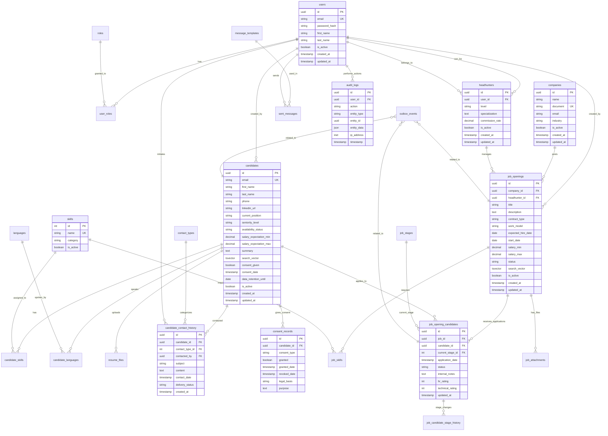

# Diagrama ER - Sistema de Banco de Talentos

```mermaid
erDiagram
    %% Usuários e Autenticação
    users ||--o{ user_roles : has
    roles ||--o{ user_roles : granted_to
    users ||--o{ headhunters : can_be
    users ||--o{ candidates : created_by
    users ||--o{ job_openings : created_by

    %% Empresas e Headhunters
    companies ||--o{ job_openings : posts
    headhunters ||--o{ job_openings : manages
    headhunters }o--|| users : belongs_to

    %% Candidatos e Skills
    candidates ||--o{ candidate_skills : has
    skills ||--o{ candidate_skills : assigned_to
    candidates ||--o{ candidate_languages : speaks
    languages ||--o{ candidate_languages : spoken_by
    candidates ||--o{ resume_files : uploads
    candidates ||--o{ candidate_contact_history : contacted
    candidates ||--o{ consent_records : gives_consent

    %% Vagas e Candidaturas
    job_openings ||--o{ job_skills : requires
    skills ||--o{ job_skills : required_for
    job_openings ||--o{ job_opening_candidates : receives_applications
    candidates ||--o{ job_opening_candidates : applies_to
    job_stages ||--o{ job_opening_candidates : current_stage
    job_opening_candidates ||--o{ job_candidate_stage_history : stage_changes
    job_openings ||--o{ job_attachments : has_files

    %% Contatos e Mensagens
    contact_types ||--o{ candidate_contact_history : categorizes
    users ||--o{ candidate_contact_history : initiates
    message_templates ||--o{ sent_messages : used_in
    users ||--o{ sent_messages : sends

    %% Auditoria e Eventos
    users ||--o{ audit_logs : performs_actions
    outbox_events }o--|| candidates : related_to
    outbox_events }o--|| job_openings : related_to
    outbox_events }o--|| job_opening_candidates : related_to

    %% Definições das entidades principais
    users {
        uuid id PK
        string email UK
        string password_hash
        string first_name
        string last_name
        boolean is_active
        timestamp created_at
        timestamp updated_at
    }

    candidates {
        uuid id PK
        string email UK
        string first_name
        string last_name
        string phone
        string linkedin_url
        string current_position
        string seniority_level
        string availability_status
        decimal salary_expectation_min
        decimal salary_expectation_max
        text summary
        tsvector search_vector
        boolean consent_given
        timestamp consent_date
        date data_retention_until
        boolean is_active
        timestamp created_at
        timestamp updated_at
    }

    job_openings {
        uuid id PK
        uuid company_id FK
        uuid headhunter_id FK
        string title
        text description
        string contract_type
        string work_model
        date expected_hire_date
        date start_date
        decimal salary_min
        decimal salary_max
        string status
        tsvector search_vector
        boolean is_active
        timestamp created_at
        timestamp updated_at
    }

    job_opening_candidates {
        uuid id PK
        uuid job_id FK
        uuid candidate_id FK
        int current_stage_id FK
        timestamp application_date
        string status
        text internal_notes
        int hr_rating
        int technical_rating
        timestamp updated_at
    }

    companies {
        uuid id PK
        string name
        string document UK
        string email
        string industry
        boolean is_active
        timestamp created_at
        timestamp updated_at
    }

    headhunters {
        uuid id PK
        uuid user_id FK
        string level
        text specialization
        decimal commission_rate
        boolean is_active
        timestamp created_at
        timestamp updated_at
    }

    skills {
        int id PK
        string name UK
        string category
        boolean is_active
    }

    candidate_contact_history {
        uuid id PK
        uuid candidate_id FK
        int contact_type_id FK
        uuid contacted_by FK
        string subject
        text content
        timestamp contact_date
        string delivery_status
        timestamp created_at
    }

    consent_records {
        uuid id PK
        uuid candidate_id FK
        string consent_type
        boolean granted
        timestamp granted_date
        timestamp revoked_date
        string legal_basis
        text purpose
    }

    audit_logs {
        uuid id PK
        uuid user_id FK
        string action
        string entity_type
        uuid entity_id
        json entity_data
        inet ip_address
        timestamp timestamp
    }
```